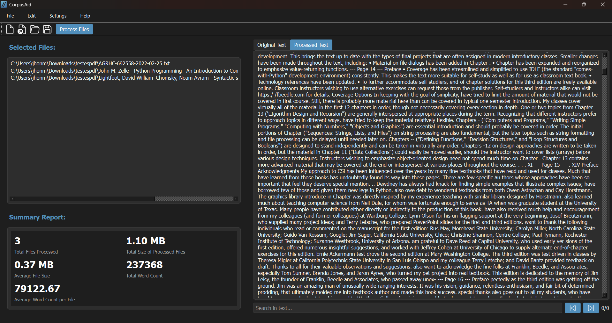

# CorpusAid

[](https://choosealicense.com/licenses/mit/)

CorpusAid is a desktop corpus preprocessing workbench built with PySide6. It lets researchers load thousands of plain-text documents, configure a reproducible cleaning pipeline, preview results, and export the processed corpus. The application ships with spaCy-powered linguistic helpers and optional Rust bindings that keep previews responsive even on large datasets.

## Highlights
- Configurable pipeline that toggles normalization, page artifact removal, HTML stripping, tokenization, stop-word filtering, regex substitutions, and more; parameters are validated before execution to avoid corrupting data.
- Fast corpus ingestion via drag-and-drop or recursive folder scans. An optional `rust_preview` extension accelerates directory walks and preview loading with a transparent Python fallback.
- Interactive preview and editing workspace with streamed snippets (up to 5,000 characters), undo/redo history, and responsive UI powered by background workers.
- Batch processing with safety nets: thread-pooled workers, progress feedback, warning surfacing, and automatic `.bak` backups before overwriting source files.
- Reports and monitoring through a summary dashboard (file counts, sizes, token statistics, timings) plus structured logging in `src/logs/CorpusAid.log`.
- Research-friendly UX extras including dark/light themes, an advanced regex wizard, inline documentation (`docs/documentation.html`), and a built-in update checker.



## Repository Layout
- `src/CorpusAid.py` - PySide6 application entry point and preprocessing pipeline.
- `config/requirements.txt` - Python dependencies for running from source.
- `rust_preview/` - Optional Rust crate exposing fast preview helpers via `maturin`.
- `src/assets/` - Icons, fonts, and screenshots referenced by the UI.
- `src/docs/` - In-app documentation rendered inside the help view.

## Prerequisites
- Python 3.9 or newer.
- pip (virtual environments recommended).
- spaCy English model `en_core_web_sm`.
- Optional: Rust toolchain and `maturin` to build the native preview module.
- PySide6 wheels include Qt WebEngine; ensure your platform supports it for the preview pane.

## Running from Source
```bash
git clone https://github.com/jhlopesalves/CorpusAid.git
cd CorpusAid
python -m venv .venv
# Windows PowerShell
. .venv/Scripts/Activate.ps1
pip install -r config/requirements.txt
python -m spacy download en_core_web_sm
python src/CorpusAid.py
```

When packaging for end users you can continue using the existing installer or tools such as `pyinstaller`.

## Optional Native Preview Module
The Rust helper keeps directory scans and previews smooth on very large corpora. CorpusAid automatically falls back to the Python implementation if the module is absent.

```bash
pip install maturin
cd rust_preview
maturin develop --release
```

Restart the application after building so it can detect the compiled extension.

## Typical Workflow
1. **Load documents** - Use `File -> Open` or drag-and-drop files or folders. Folder scans surface progress and can be cancelled at any time.
2. **Configure preprocessing** - Open the parameters dialog to toggle normalization, artifact removal, tokenization, stop-word filtering, and custom regex patterns. The advanced builder helps compose complex expressions safely.
3. **Preview and iterate** - Inspect streamed previews (capped at 5,000 characters), switch between original and processed text, and undo or redo manual edits when needed.
4. **Run the batch** - Processing runs in parallel, keeps the UI responsive, and surfaces warnings for files that need attention.
5. **Review the report** - The summary tab consolidates size, token, and timing metrics alongside the active configuration.
6. **Save results** - Overwrite source files only after confirmation. CorpusAid creates `.bak` backups before writing processed text.

## Logging and Support
- Runtime logs are stored at `src/logs/CorpusAid.log`; include this file when reporting issues.
- Documentation is bundled in `docs/documentation.html` and available from the help menu.
- Issues and feature requests are welcome via GitHub.

## License
[MIT](https://choosealicense.com/licenses/mit/)
